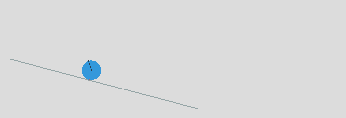
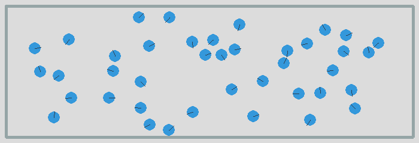

Introduction
============

This tutorial shows how to make applications with the **2D physics**
framework Pymunk in an object-oriented programming style.

About the naming of variables
-----------------------------

Before we get started, get familiar with some conventions used in this tutorial.
In order to make the programs simple and short, we will use short variable names.

- ``b`` stands for **Body**
- ``c`` stands for **Constraint**
- ``s`` stands for **Shape**

An important class is the ``Vec2d`` class which indicates either
the absolute position of a point in space, or the direction 
vector between two points. 

- ``p`` stands for **position**
- ``v`` stands for **vector**

We could define a vector as the difference between two points in space::

    v = p1 - p0

A final ``s`` serves as a plural marker.

- ``bs`` is a list of **bodies**
- ``ps`` is a list of **positions**
- ``vs`` is a list of **vectors**

We can use the plural marker in a loop structure such as::

    for b in bs:
        print(b)

The static body is used frequently, so we give it the short name ``b0`` ::

    b0 = space.static_body

The abstract Body
-----------------

The ``Body`` class describes the physical aspects of an objects. 
These aspects cannot be seen, but describe how it moves.
Six properties describe the state of a body

* ``mass`` - how heavy it is
* ``moment`` - it's resistance to rotation
* ``position`` - it's spatial location
* ``angle`` - the current orientation
* ``velocity`` - how fast and in which direction it is moving
* ``angular_velocity`` - how fast in which direction it is rotatting

A bouncing ball
---------------

We start this tutorial with a simple bouncing ball simulation. 
The first thing we need to do is to import the ``pymunk`` and the ``pygame`` module::

    import pymunk
    import pymunk.pygame_util
    import pygame

Then we initialize the Pygame module and define the ``screen`` surface where
we are going to draw the simulation result. Pymunk comes with a simple
draw option which can be used for quick prototyping::

    pygame.init()
    size = 640, 240
    screen = pygame.display.set_mode(size)
    draw_options = pymunk.pygame_util.DrawOptions(screen)

The 2D physics simulation takes place in a ``Space`` object. 
We define ``space`` as a global variable and assign it a gravity vector::

    space = pymunk.Space()
    space.gravity = 0, -900

To create a fixed ground for our object we create a ``Segment`` shape
attached to the static body ``b0``.
In order to make the ball bounce, we give it an elasticity of 1::

    b0 = space.static_body
    segment = pymunk.Segment(b0, (0, 0), (640, 0), 4)
    segment.elasticity = 1

Next, we create a dynamic body and give it a mass, moment and position::

    body = pymunk.Body(mass=1, moment=10)
    body.position = 100, 200

Then we create a ``Circle`` shape and attach it to the body::

    circle = pymunk.Circle(body, radius=20)
    circle.elasticity = 0.95

Finally we add the ``body``, ``circle`` and ``segment`` to the ``space``.
Now we are ready for simulation::

    space.add(body, circle, segment)

In the last part we start the Pygame event loop. 
The only event we are going to detect is the QUIT event::

    running = True
    while running:
        for event in pygame.event.get():
            if event.type == pygame.QUIT:
                running = False

In the latter part of the event loop we draw the obejcts. 
First we fill the screen with a gray background color.
Then we draw the two objects with the ``space.debug_draw()`` function, 
call the display update function, 
and finally step the simulation forward by 0.01 time units::

        screen.fill(GRAY)
        space.debug_draw(draw_options)
        pygame.display.update()
        space.step(0.01)

    pygame.quit()

:download:`intro1.py<intro1.py>`

Creating an App class
---------------------

To simplfy the tutorial examples we will create a reusable ``App`` class
which will run the simulation. This class will:

* initialize Pygame
* create a ``screen`` object
* create a ``space`` object
* set the draw option
* run the event loop
* draw the objects to the screen

Here is the class definition with the constructor method::

    class App:
        def __init__(self):
            pygame.init()
            self.screen = pygame.display.set_mode((700, 240))
            self.draw_options = pymunk.pygame_util.DrawOptions(self.screen)
            self.running = True

The ``App`` class has a ``run()`` method which runs the Pygame event loop::

    def run(self):
        while self.running:
            for event in pygame.event.get():
                if event.type == pygame.QUIT:
                    self.running = False
                    pygame.image.save(self.screen, 'intro.png')

            self.screen.fill((220, 220, 220))
            space.debug_draw(self.draw_options)
            pygame.display.update()
            space.step(0.01)

        pygame.quit()

:download:`intro.py<intro.py>`

A ball rolling down slope
---------------------------------

We can now import ``pymunk``, ``space`` and the ``App`` class::

    from intro import pymunk, space, App

Let's define an inclined segment and give it friction::

    segment = pymunk.Segment(space.static_body, (20, 120), (400, 20), 1)
    segment.elasticity = 0.5
    segment.friction = 0.5

The circle shape also needs friction, in order to roll. 
Whithout friction it would just glide down the slope::

    circle = pymunk.Circle(body, radius=20)
    circle.elasticty = 0.5
    circle.friction = 0.5
    space.add(body, circle, segment)

Finally we instantiate the app and call the ``run()`` method::

    App().run()

:download:`intro2.py<intro2.py>`

A block sliding down a slope
----------------------------

The ``Poly`` class has a method to create box shapes. 
Without elasticity it slides down the slope::

    box = pymunk.Poly.create_box(body, (50, 50))
    space.add(body, box, segment)

:download:`intro3.py<intro3.py>`

A block tumbling down a slope
-----------------------------

Now we add elasticity to the box shape. 
It tumbles down the slope::

    box = pymunk.Poly.create_box(body, (50, 50))
    box.elasticity = 0.95
    space.add(body, box, segment)

:download:`intro4.py<intro4.py>`

A ball inside a box
-------------------

In order to draw a closed box where objects can bounce, 
we must get the 4 corner points. From those we can create 4 segments. 
We give them an elasticity of 0.999 as a value of 1 or larger can lead 
to an instable system::

    pts = [(10, 10), (690, 10), (690, 230), (10, 230)]
    for i in range(4):
        seg = pymunk.Segment(space.static_body, pts[i], pts[(i+1)%4], 2)
        seg.elasticity = 0.999
        space.add(seg)

In order to give the ball an inital lateral movement we apply an 
impulse vector of (100, 0) to it at initialization::

    body = pymunk.Body(mass=1, moment=10)
    body.position = (100, 200)
    body.apply_impulse_at_local_point((100, 0))

:download:`intro5.py<intro5.py>`

Many particles in a box
-----------------------

In order to simulate many particles in a box, we first turn off gravity. 
The we create a large number of particles at random location and give them
random impulses as a starting movement::

    space.gravity = 0, 0
    for i in range(40):
        body = pymunk.Body(mass=1, moment=10)
        body.position = randint(40, 660), randint(40, 200)
        impulse = randint(-100, 100), randint(-100, 100)       
        body.apply_impulse_at_local_point(impulse)
        circle = pymunk.Circle(body, radius=10)
        circle.elasticity = 0.999
        circle.friction = 0.5
        space.add(body, circle)

:download:`intro6.py<intro6.py>`

Pin joint
---------

A ``PinJoint`` links two bodies with a solid link or pin. For all static points of attachement
we use the same ``space.static_body`` which has its default position at (0, 0)::

    b0 = space.static_body

As the dynamic body we place a sphere at (100, 100)::

    body = pymunk.Body(mass=1, moment=10)
    body.position = (100, 100)
    circle = pymunk.Circle(body, radius=20)

The ``PinJoint`` methode takes 2 bodies and their local positions as argument. 
We place the static body ``b0``'s anchor at (200, 200) and leave the dynamic ``body`` at its default anchor 
of (0, 0). This creates a pin between static point (200, 200) and dynamic point (100, 100)::

    joint = pymunk.constraint.PinJoint(b0, body, (200, 200))

Due to gravity, the pendulum starts swinging.

:download:`intro7.py<intro7.py>`

Double pendulum
---------------

If a moving eleastic pendulum hits another pendulum of the same mass, the energy 
is entirely transferred to the second object.

:download:`intro8.py<intro8.py>`

Newton's cradle
---------------

Newton's cradle is a device that demonstrates conservation of momentum and energy 
using a series of swinging spheres. 

:download:`intro9.py<intro9.py>`