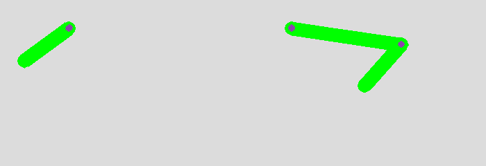
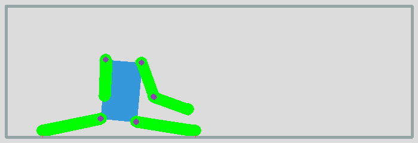
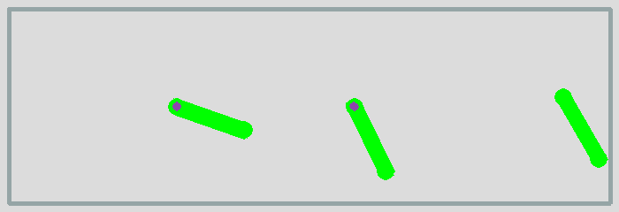
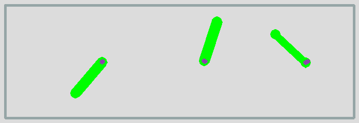
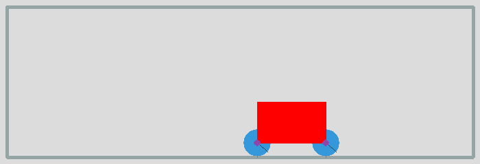
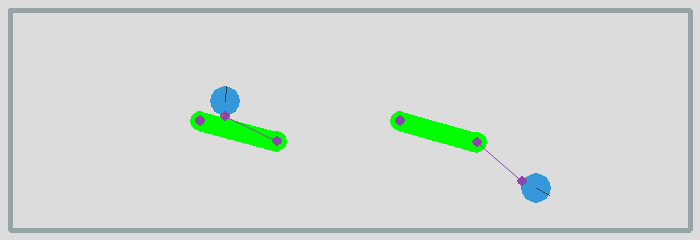
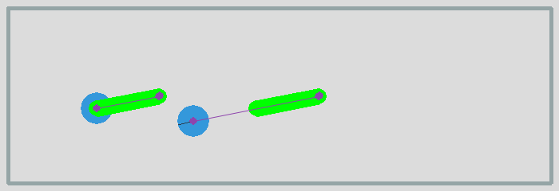
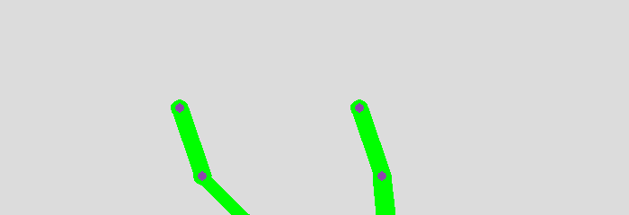

Constraints and joints
======================

A constraint describes how two bodies interact with each other.
Constraints can be simple joints, which allow bodies to pivot around each other.

Pin joint
---------

The pin joint links two bodies with a solid bar or pin. 

.. image:: pin1.png

We create a class ``PintJoint`` which adds the new joint directly to the ``space``, which 
saves us one line of code::

    class PinJoint:
        def __init__(self, a, b, anchor_a=(0, 0), anchor_b=(0, 0)):
            joint = pymunk.constraint.PinJoint(a, b, anchor_a, anchor_b)
            space.add(joint)

Furthermore we define the static body ``b0`` which will be used for everything static::

    b0 = space.static_body

We will label position points with ``p`` and vectors with ``v``. 
The suspension point for the pendulum is ``p0`` and the direction of its associated pin is ``v``::

    p0 = Vec2d(300, 200)
    v = Vec2d(80, 0)

Now we can define the first circular body ``c`` and attach it with a pin joint 
to the static body ``b0`` at position ``p0``::

    c = Circle(p0+v)
    PinJoint(b0, c.body, p0)

A second circular body is placed at twice the distance::

    c = Circle(p0+2*v)
    PinJoint(b0, c.body, p0)

The two pendulum swing at different frequencies.

:download:`pin1.py<pin1.py>`

Double pendulum
---------------

The double pendulum is a pendulum linked to another one. 
Together they execute a complicated chaotic movement.

The first segment is identical to the previous one::

    c = Circle(p0+v)
    PinJoint(b0, c.body, p0)

The second segment is attached to the first circular disc::

    c2 = Circle(p0+2*v)
    PinJoint(c.body, c2.body)

The two pendulum create a complicated movement.

:download:`pin2.py<pin2.py>`

The pivot joint
---------------

A pivot joint allows two objects to pivot about a single point.

We define a new ``PivotJoint`` class which adds the joint directly to the space::

    class PivotJoint:
        def __init__(self, a, b, anchor_a=(0, 0), anchor_b=(0, 0)):
            joint = pymunk.constraint.PinJoint(a, b, anchor_a, anchor_b)
            space.add(joint)

We define the first segment with its position point ``p0`` and its
direction vector ``v``. Then we define a pivot joint in the static 
body ``b0`` located at position ``p0``::

    segment = Segment(p0, v)
    PivotJoint(b0, segment.body, p0)

A bit to the right, we create another segment, twice the length of the first::

    segment = Segment(p0+4*v, 2*v)
    PivotJoint(b0, segment.body, p0+4*v)

To this longer segment we attach a shorter one to create a double pendulum::

    segment2 = Segment(p0+6*v, v)
    PivotJoint(segment.body, segment2.body, 2*v)

:download:`joint1.py<joint1.py>`

Rag doll
--------

In a rag doll, the different elements of the body (torso, arm, forarm, leg) can 
cross, without creating collisions. This is possible when the shapes belong
to the same group::

    shape.filter = pymunk.ShapeFilter(group=1)

We define the torse by it's center point ``p0`` and the 4 vertices::

    p0 = Vec2d(200, 150)
    vs = [(-30, 50), (30, 50), (40, -50), (-40, -50)]
    v0, v1, v2, v3 = vs
    torso = Poly(p0, vs)
    c = pymunk.Circle(torso.body, 20, (0, 70))
    space.add(c)

Then we attach the left arm to the torso::

    arm = Segment(p0+v0, -v)
    PivotJoint(torso.body, arm.body, v0, (0, 0))

and then the left forearm to the upper arm::

    forearm = Segment(p0+v0-v, -v)
    PivotJoint(arm.body, forearm.body, -v, (0, 0))

We do the same on the right side, and finally attach the two legs::

    leg = Segment(p0+v2, (20, -100))
    PivotJoint(torso.body, leg.body, v2, (0, 0))

:download:`joint2.py<joint2.py>`

Motors
------

The ``SimpleMotor`` class keeps the relative angular velocity 
between two bodies at a constant rate::

    class SimpleMotor:
        def __init__(self, a, b, rate):
            joint = pymunk.constraint.SimpleMotor(a, b, rate)
            space.add(joint)

In the following example code we have 3 constraints:

* a pivot joint makes a segment rotation around a point
* a pivot + motor joint, makes a rotation around a pivot point at a constant angular speed (10 radians/s)
* a motor joint, makes a freely moving segment follow the motor angle

This is the passive pivot joint::

    p0 = 200, 120
    v = 80,10
    arm = Segment(p0, v)
    PivotJoint(b0, arm.body, p0)

This is the motorized pivot joint::

    p1 = 400, 120
    arm = Segment(p1, v)
    PivotJoint(b0, arm.body, p1)
    SimpleMotor(b0, arm.body, 10)

This is the motor joint without a pivot::

    p2 = 600, 120
    arm = Segment(p2, v)
    SimpleMotor(b0, arm.body, 10)

:download:`joint3.py<joint3.py>`

Motors moving at different speeds
---------------------------------

In the following example 3 segments move at 3 different rotation rates.
The first motor moves at speed 1::

    arm = Segment(p0, v)
    PivotJoint(b0, arm.body, p0)
    SimpleMotor(b0, arm.body, 1)

The second motor moves at speed 3 and the last one at speed 6, 
which means about one rotation per second.

:download:`joint4.py<joint4.py>`

A car
-----

To create a simplistic car we attach 2 wheels to a rectangular chassis,
based on a central position point and a vertex list::

    p0 = Vec2d(200, 150)
    vs = [(-50, -30), (50, -30), (50, 30), (-50, 30)]
    v0, v1, v2, v3 = vs
    chassis = Poly(p0, vs)

We place the wheels to the lower left and right corners of the chassis::

    wheel1 = Circle(p0+v0)
    wheel2 = Circle(p0+v1)

Both wheels are then motorized at the same speed::

    PivotJoint(chassis.body, wheel1.body, v0, (0, 0))
    SimpleMotor(chassis.body, wheel1.body, 5)

:download:`joint5.py<joint5.py>`

A slide joint
-------------

A slide joint is like a pin joint, but instead of having a fixed distance, 
the distance between the two anchor points can vary between a minimum and maximum
distance. First we define a rotating arm created from a ``Segment``.
The segment is placed at position ``p0`` and has a direction vector ``v``::

    p0 = Vec2d(200, 120)
    v = Vec2d(80, 0)
    arm = Segment(p0, v)

In order to rotate the arm, we add to joints: a pivot joint and a simple motor 
joint::

    PivotJoint(b0, arm.body, p0)
    SimpleMotor(b0, arm.body, 1)

The we create a ball from the ``Circle`` class and attach with a ``SlideJoint`` 
to the rotating arm::

    ball = Circle(p0+v+(40, 0), r)
    SlideJoint(arm.body, ball.body, v, (-r, 0), min, max)

In this case the arm and the ball do collide. Now we create a second
arm-and-ball mechanism, and this time don't allow bodies to collide::

    ball = Circle(p0+v+(40, 0), r)
    SlideJoint(arm.body, ball.body, v, (-r, 0), min, max, False)

This is the simulation result. The first ball collides with the arm.
The second ball does not collide with the moving arm.

:download:`joint6.py<joint6.py>`

A groove joint
--------------

GrooveJoint is similar to a PivotJoint, but with a linear slide.
First we create a rotating arm::

    arm = Segment(p0, v)
    PivotJoint(b0, arm.body, p0)
    SimpleMotor(b0, arm.body, 1)

Then we create a circle and attach it to a groove joint::

    ball = Circle(p0+v, 20)
    GrooveJoint(arm.body, ball.body, (0, 0), v, (0, 0))

:download:`joint7.py<joint7.py>`

Damped rotary spring and rotary limit joint
-------------------------------------------

To simplify its use we define again two new classes::

    class DampedRotarySpring:
        def __init__(self, a, b, rest_angle, stiffness, damping):
            joint = pymunk.constraint.DampedRotarySpring(a, b, rest_angle, stiffness, damping)
            space.add(joint)

    class RotaryLimitJoint:
        def __init__(self, a, b, min, max, collide=True):
            joint = pymunk.constraint.RotaryLimitJoint(a, b, min, max)
            joint.collide_bodies = collide
            space.add(joint)

Then we define a rotary segment::

    arm = Segment(p0, v)
    PivotJoint(b0, arm.body, p0)
    SimpleMotor(b0, arm.body, 1)

We attache a second arm segment via a damped rotary spring::

    arm2 = Segment(p0+v, v)
    PivotJoint(arm.body, arm2.body, v, (0, 0))
    DampedRotarySpring(arm.body, arm2.body, 0, 10000000, 10000)

:download:`joint8.py<joint8.py>`

Gear joint
----------

A gear joint keeps the angular velocity ratio of a pair of bodies constant.

We define two wheels who touch::

    p0 = Vec2d(200, 120)
    r1, r2 = 40, 80
    v = Vec2d(r1+r2, 0)
    wheel1 = Circle(p0, r1)
    wheel2 = Circle(p0+v, r2)

Then we motorize the first wheel, place a pivot on both bodies, and add
a gear joint with a ratio of -r2/r1::

    SimpleMotor(b0, wheel1.body, 5)
    PivotJoint(b0, wheel1.body, p0)
    PivotJoint(b0, wheel2.body, p0+v)
    GearJoint(wheel1.body, wheel2.body, 0, -r2/r1)

.. image:: joint10.png

:download:`joint10.py<joint10.py>`
