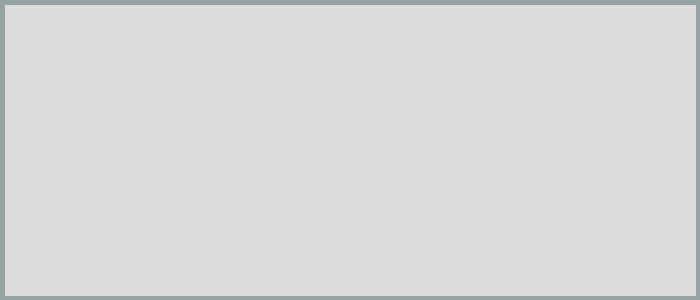
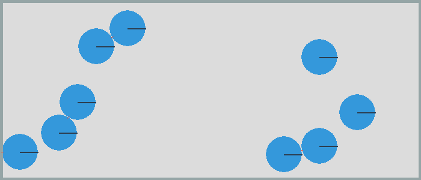
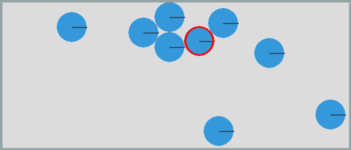
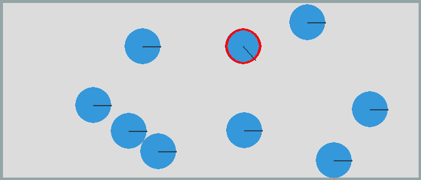
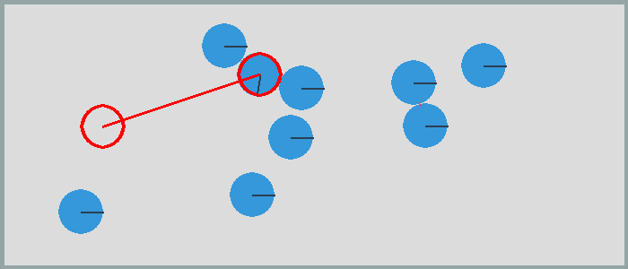
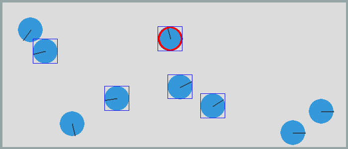
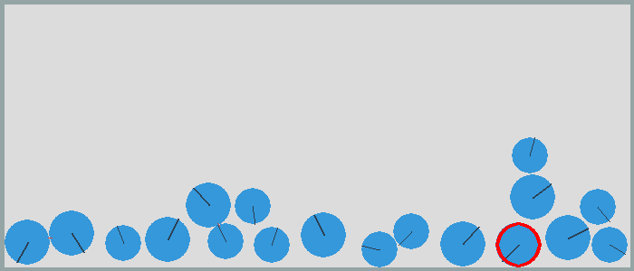

Using mouse and keyboard
========================

In this section we look at using the mouse and keyboard 
to interact with shapes and bodies.

Starting file
-------------

Our starting point is a file which alreaday has the:

* ``App`` class to create the application
* ``Box`` class to draw a static rectangular segment box
* ``Circle`` class to create dynamic circles

The ``Box`` class takes 2 diagonal points ``p0`` and ``p1`` and creates
4 static segments. The default is to place a box around the screen.

.. literalinclude:: mouse0.py
   :pyobject: Box

The program reacts to the

* ``QUIT`` button to close the window
* ``Q`` and ``ESCAPE`` key to end the application
* ``P`` key to save a screen capture under the name ``mouse.png``

.. literalinclude:: mouse0.py
   :pyobject: App.do_event

This code at the end of the file creates an empty box and runs the app::

    if __name__ == '__main__':
        Box()
        App().run()

:download:`mouse0.py<mouse0.py>`

.. literalinclude:: mouse0.py

Create balls at random locations
--------------------------------

We place 9 balls at random positions inside the box. 
In this example there is no gravity::

    if __name__ == '__main__':
        Box()

        r = 25
        for i in range(9):
            x = random.randint(r, w-r)
            y = random.randint(r, h-r)
            Circle((x, y), r)

        App().run()

Select a ball with the mouse
----------------------------

Now let's use a ``MOUSEBUTTONDOWN`` event to select an 
active shape with a mouse click. The two functions 
``from_pygame`` and ``to_pygame`` allow us to change between

* ``pygame`` coordinates with the origin at the upper left
* ``pymunk`` coordinates with the origin at the lower left

The ``point_query(p)`` method checks if point ``p`` is inside the shape::

    elif event.type == MOUSEBUTTONDOWN:
        p = from_pygame(event.pos, self.screen)
        self.active_shape = None
        for s in space.shapes:
            dist, info = s.point_query(p)
            if dist < 0: 
                self.active_shape = s

When there is an active shape, we surround it with a red circle::

    if self.active_shape != None:
        s = self.active_shape
        r = int(s.radius)
        p = to_pygame(s.body.position, self.screen)
        pygame.draw.circle(self.screen, RED, p, r, 3)

Move the active shape with keys
-------------------------------

Let's use the arrow keys to move the active object.
For this we define a dictionary where we association the 4 direction
unit vectors with the 4 arrow keys. If the key pressed is an arrow key,
we move the active shape 20 pixels into that direction::

    keys = {K_LEFT: (-1, 0), K_RIGHT: (1, 0),
            K_UP: (0, 1), K_DOWN: (0, -1)}
    if event.key in keys:
        v = Vec2d(keys[event.key]) * 20
        if self.active_shape != None:
            self.active_shape.body.position += v

Rotate an object with the mouse
-------------------------------

We can use the mouse-click into an object to change its angle.
All we need to add is this line of code in the ``MOUSEBUTTONDOWN`` section::

    s.body.angle = (p - s.body.position).angle

Pull a ball with the mouse
--------------------------

When releasing the mouse button, we take the mouse position and apply
an impulse to the ball which is proportional to the red line drawn with
the mouse, with ``p0`` being the object position and ``p1`` being 
the mouse position::

    elif event.type == MOUSEBUTTONUP:
        if self.pulling:
            self.pulling = False
            b = self.active_shape.body
            p0 = Vec2d(b.position)
            p1 = from_pygame(event.pos, self.screen)
            impulse = 100 * Vec2d(p0 - p1).rotated(-b.angle)
            b.apply_impulse_at_local_point(impulse)

To draw the red line we add this to the drawing code::

    if self.active_shape != None:
        b = self.active_shape.body
        r = int(self.active_shape.radius)
        p0 = to_pygame(b.position, self.screen)
        pygame.draw.circle(self.screen, RED, p0, r, 3)
        if self.pulling:
            pygame.draw.line(self.screen, RED, p0, self.p, 3)
            pygame.draw.circle(self.screen, RED, self.p, r, 3)

Which results in this

New objects at mouse position
-----------------------------

Inside the ``do_event()`` section we add the following code::

    if event.key == K_c:
        p = from_pygame(pygame.mouse.get_pos(), self.screen)
        Circle(p, radius=20)

This will add smaller circles at the mouse position.

.. image:: mouse5.png

Remove an object
----------------

To remove the active object we add the following code::

    if event.key == K_BACKSPACE:
        s = self.active_shape
        if s != None:
            space.remove(s, s.body)
            self.active_shape = None

Add a bounding box (BB)
-----------------------

Inside the ``MOUSEBUTTONDOWN`` section if clicking inside a shape,
we add the following test to add the shape to the current selection
if the **cmd** key is pressed::

    if pygame.key.get_mods() & KMOD_META:
        self.selected_shapes.append(s)
        print(self.selected_shapes)
    else:
        self.selected_shapes = [] 

In order to draw a shape's bounding box (BB) we add the following method::

.. literalinclude:: mouse.py
   :pyobject: App.draw_bb

In the App's ``draw()`` section we add::

    for s in self.selected_shapes:
        self.draw_bb(s)

This shows the currently selected objects with a bounding box.

Toggle gravity
--------------

In order to turn on and off gravity we add the following code::

    elif event.key == K_g:
        self.gravity = not self.gravity
        if self.gravity:
            space.gravity = 0, -900
        else:
            space.gravity = 0, 0

With gravity turned on, the circles fall to the ground.

Complete source code
--------------------

Here is the complete file.

:download:`mouse.py<mouse.py>`

.. literalinclude:: mouse.py

