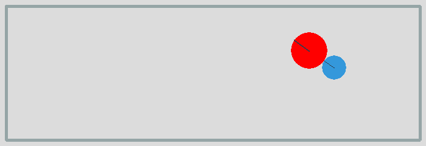
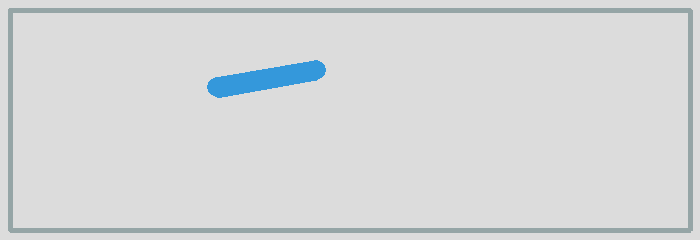

Shapes
======

In this section we look at different shapes. Shapes are attached to bodies. 
There are three basic shape classes:

* Circle
* Segment
* Poly

The Box class
-------------

Many of the simulations require a static box to contain the dynamic elements. 
So let's define the ``Box`` class which takes 2 diagonal end points to define a box::

    class Box:
        def __init__(self, p0=(10, 10), p1=(690, 230), d=2):
            x0, y0 = p0
            x1, y1 = p1
            pts = [(x0, y0), (x1, y0), (x1, y1), (x0, y1)]
            for i in range(4):
                segment = pymunk.Segment(space.static_body, pts[i], pts[(i+1)%4], d)
                segment.elasticity = 1
                segment.friction = 1
                space.add(segment)

The new class library for this section can be found here: 

:download:`shape.py<shape.py>`

A simple compound shape
-----------------------

Two separate shapes can be attached to a body. 
To distinguish them we give them different colors.

:download:`shape1.py<shape1.py>`

A moving segment
----------------

Segments are linear elements which have a radius.
The following code represents a segment of length 100 with its center of gravity at the center::

    body = pymunk.Body(mass=1, moment=1000)
    body.position = (100, 200)
    body.apply_impulse_at_local_point((100, 0), (0, 1))

    shape = pymunk.Segment(body, (-50, 0), (50, 0), radius=10)
    shape.elasticity = 0.999
    space.add(body, shape)

:download:`shape2.py<shape2.py>`